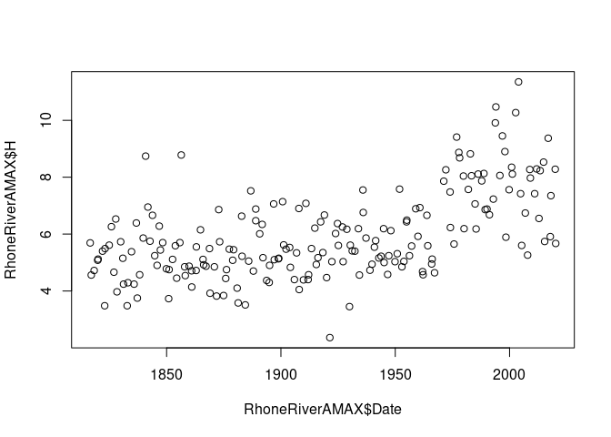
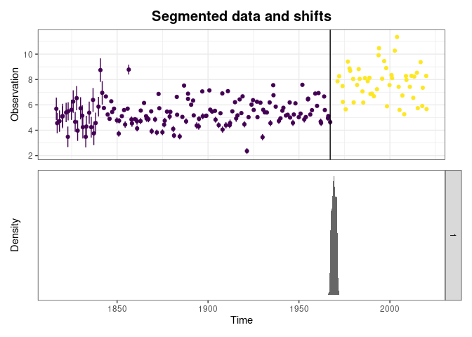
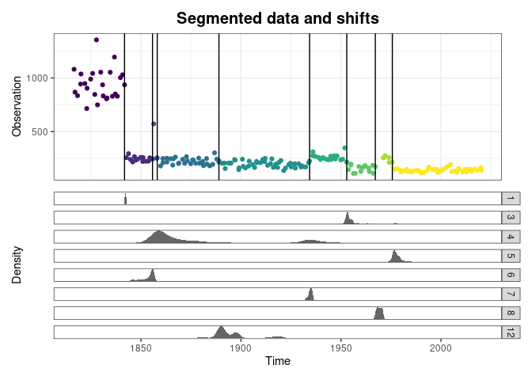
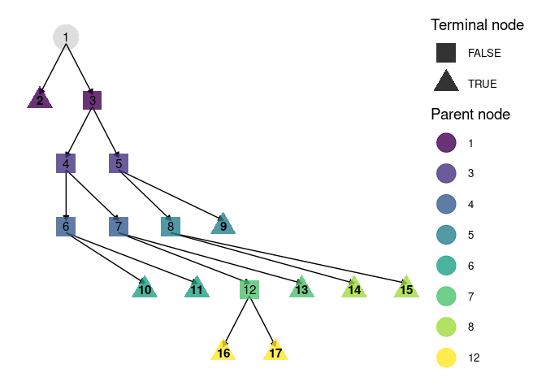
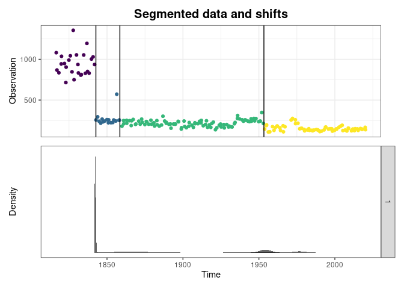
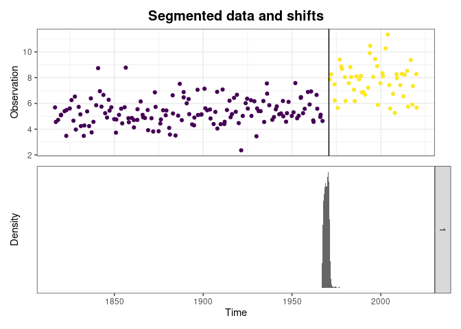

Shift Happens
================
Felipe MENDEZ and Benjamin RENARD (INRAE)
February 2026

- [Introduction](#introduction)
- [Segmentation of a series of
  observations](#segmentation-of-a-series-of-observations)
  - [Motivating dataset](#motivating-dataset)
  - [Basic usage](#basic-usage)
  - [Advanced usages](#advanced-usages)
- [Segmentation based on recursive
  modeling](#segmentation-based-on-recursive-modeling)
  - [Motivating dataset](#motivating-dataset-1)
  - [Recursive linear regression](#recursive-linear-regression)
  - [Recursive application of the BaRatin rating curve
    method](#recursive-application-of-the-baratin-rating-curve-method)
- [Segmentation based on stage
  recessions](#segmentation-based-on-stage-recessions)
  - [Motivating dataset](#motivating-dataset-2)
  - [Recession extraction](#recession-extraction)
  - [Recession segmentation](#recession-segmentation)
- [References](#references)

# Introduction

`ShiftHappens` is an `R` package for detecting, visualizing and
estimating shifts, with a specific focus on hydrology and hydrometry
applications. The package is derived from previous works, in particular:

1.  [BayDERS](https://github.com/MatteoDarienzo/BayDERS) developed by
    [@darienzoDetectionEstimationStagedischarge2021](https://theses.hal.science/tel-03211343).
2.  [RatingShiftHappens](https://github.com/Felipemendezrios/RatingShiftHappens),
    a previous version of this package.

``` r
# devtools::install_github("benRenard/ShiftHappens") # Install before first use
library(ShiftHappens)
```

# Segmentation of a series of observations

## Motivating dataset

The dataset `RhoneRiverAMAX` coming with the package contains annual
maximum stages (`H`, $m$) and discharges (`Q`, $m^3.s^{-1}$) for the
Rhone River at Beaucaire, France, along with the associated
uncertainties expressed as standard deviations (`uH` and `uQ`). For more
details on this dataset, see
[@lucas2023](https://hal.inrae.fr/hal-04170646).

``` r
 plot(RhoneRiverAMAX$Date,RhoneRiverAMAX$H)
```



## Basic usage

To segment a series of observations without knowing the number of
segments, we recommend starting with the function
`Segmentation_Recursive`. With its default arguments, this function
attempts to split the series into two segments using the method
described in
[@gombay1994](https://www.sciencedirect.com/science/article/pii/0304414994901546),
then if successful tries to further split each obtained segment into two
sub-segments, and so one until all segments cannot be further split. The
function returns an object (see `?recursiveSegmentation`) that can be
plotted (see `?plot.recursiveSegmentation`).

``` r
sg=Segmentation_Recursive(time=RhoneRiverAMAX$Date,
                         obs=RhoneRiverAMAX$H,
                         u=RhoneRiverAMAX$uH)
plot(sg)
```



For an illustration with more detected segments, consider segmenting the
series of discharge uncertainties `uQ`: the many detected changes
reflect changes in the measurement process along the years.

``` r
sg=Segmentation_Recursive(time=RhoneRiverAMAX$Date,
                          obs=RhoneRiverAMAX$uQ)
plot(sg)
```



It is also possible to visualize the recursion tree:

``` r
plot(sg$tree)
```



## Advanced usages

If the number of segments is known, the function `Segmentation_Engine`
can be used. It returns an object (see `?simpleSegmentation`) that can
be plotted. Note that if the desired number of segments is larger than
two, the aforementioned method of Gombay and Horvath (1994) is replaced
by the bayesian method described by
[@darienzoDetectionStageDischarge2021](https://doi.org/10.1029/2020WR028607).
You need to install the package
[RBaM](https://github.com/BaM-tools/RBaM) in this case.

``` r
sg=Segmentation_Engine(time=RhoneRiverAMAX$Date,
                       obs=RhoneRiverAMAX$uQ,
                       nS=4)
plot(sg)
```



When the number of segments is unknown, the function `Segmentation` will
try all possible numbers up to `nSmax`, and automatically select the
most appropriate.

``` r
sg=Segmentation(time=RhoneRiverAMAX$Date,
                obs=RhoneRiverAMAX$H,
                nSmax=4)
plot(sg)
```



# Segmentation based on recursive modeling

## Motivating dataset

## Recursive linear regression

## Recursive application of the BaRatin rating curve method

# Segmentation based on stage recessions

## Motivating dataset

## Recession extraction

## Recession segmentation

# References

<div id="refs" class="references csl-bib-body hanging-indent"
entry-spacing="0">

<div id="ref-gombay1994" class="csl-entry">

Gombay, E., and L. Horvath. 1994. “An Application of the
Maximum-Likelihood Test to the Change-Point Problem.” *Stochastic
Processes and Their Applications* 50 (1): 161–71.

</div>

</div>
