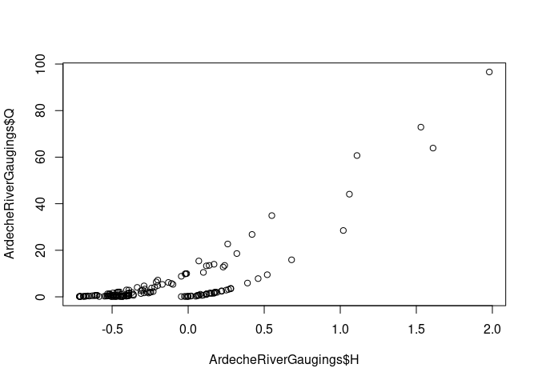
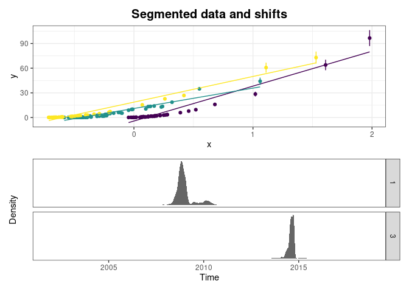
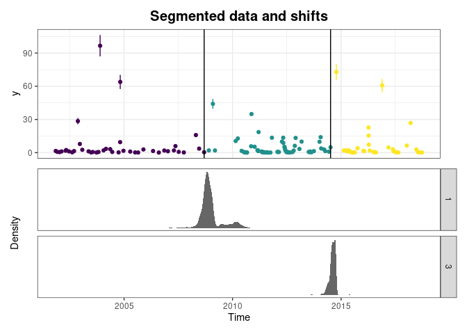
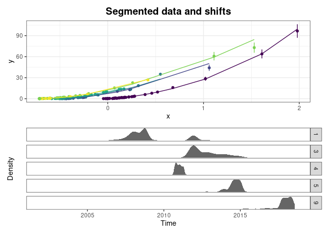
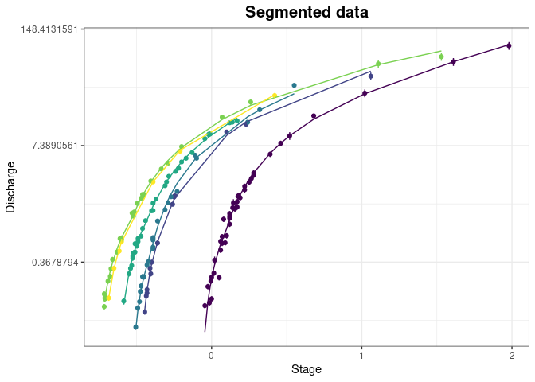
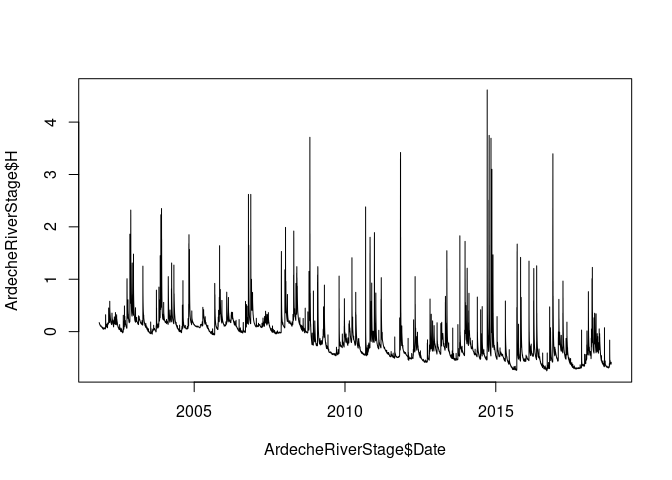
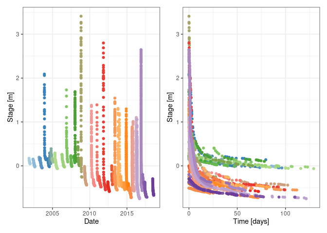
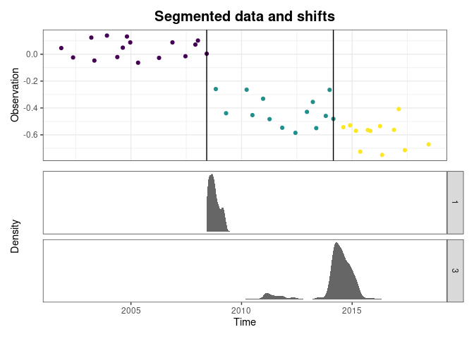
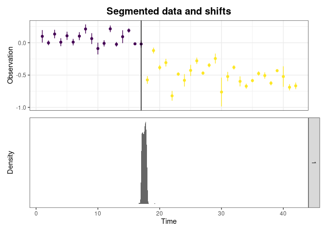

Shift Happens
================
Felipe MENDEZ and Benjamin RENARD (INRAE)
February 2026

- [Introduction](#introduction)
- [Segmentation of a series of
  observations](#segmentation-of-a-series-of-observations)
  - [Motivating dataset](#motivating-dataset)
  - [Basic usage](#basic-usage)
  - [Advanced usages](#advanced-usages)
- [Segmentation based on recursive
  modeling](#segmentation-based-on-recursive-modeling)
  - [Motivating dataset](#motivating-dataset-1)
  - [Recursive linear regression](#recursive-linear-regression)
  - [Recursive application of the BaRatin rating curve
    method](#recursive-application-of-the-baratin-rating-curve-method)
- [Segmentation based on stage
  recessions](#segmentation-based-on-stage-recessions)
  - [Motivating dataset](#motivating-dataset-2)
  - [Recession extraction](#recession-extraction)
  - [Recession segmentation](#recession-segmentation)
- [References](#references)

# Introduction

`ShiftHappens` is an `R` package for detecting, visualizing and
estimating shifts, with a specific focus on hydrology and hydrometry
applications. The package is derived from previous works, in particular:

1.  [BayDERS](https://github.com/MatteoDarienzo/BayDERS) developed by
    [Matteo Darienzo (2021)](https://theses.hal.science/tel-03211343).
2.  [RatingShiftHappens](https://github.com/Felipemendezrios/RatingShiftHappens),
    a previous version of this package.

``` r
# devtools::install_github("benRenard/ShiftHappens") # Install before first use
library(ShiftHappens)
```

# Segmentation of a series of observations

The most common segmentation task is to look for changes in a time
series.

## Motivating dataset

The dataset `RhoneRiverAMAX` coming with the package contains annual
maximum stages (`H`, $m$) and discharges (`Q`, $m^3.s^{-1}$) for the
Rhône River at Beaucaire, France, along with the associated
uncertainties expressed as standard deviations (`uH` and `uQ`). A shift
is visually apparent in the stage series around 1970. For more details
on this dataset, see [Lucas et al.
(2023)](https://hal.inrae.fr/hal-04170646).

``` r
 plot(RhoneRiverAMAX$Date,RhoneRiverAMAX$H)
```


## Basic usage

To segment a series of observations without knowing the number of
segments, we recommend starting with the function
`Segmentation_Recursive`. With its default arguments, this function
attempts to split the series into two segments using the method
described in [Gombay and Horvath
(1994)](https://www.sciencedirect.com/science/article/pii/0304414994901546),
then if successful tries to further split each obtained segment into two
sub-segments, and so one until all segments cannot be further split. The
function returns an object (see `?recursiveSegmentation`) that can be
plotted (see `?plot.recursiveSegmentation`).

``` r
sg=Segmentation_Recursive(time=RhoneRiverAMAX$Date,
                         obs=RhoneRiverAMAX$H,
                         u=RhoneRiverAMAX$uH)
sg$shifts # estimated shifts
#>          tau  I95_lower  I95_upper id_iteration
#> 1 1967-03-10 1967-04-08 1971-03-01            1
plot(sg)
```


For an illustration with more detected segments, consider segmenting the
series of discharge uncertainties `uQ`: the many detected changes
reflect changes in the measurement process along the years.

``` r
sg=Segmentation_Recursive(time=RhoneRiverAMAX$Date,
                          obs=RhoneRiverAMAX$uQ)
sg$shifts
#>          tau  I95_lower  I95_upper id_iteration
#> 1 1841-10-27 1841-10-30 1842-09-14            1
#> 5 1855-10-21 1845-10-13 1856-05-17            6
#> 3 1858-03-04 1856-08-16 1936-12-27            4
#> 8 1889-01-01 1878-12-05 1918-05-29           12
#> 6 1934-05-01 1932-07-08 1935-10-28            7
#> 2 1952-12-01 1952-01-01 1956-03-02            3
#> 7 1967-03-10 1966-12-14 1971-02-08            8
#> 4 1975-09-16 1974-10-07 1983-08-31            5
plot(sg)
```


It is also possible to visualize the recursion tree:

``` r
plot(sg$tree)
```


## Advanced usages

If the number of segments is known, the function `Segmentation_Engine`
can be used. It returns an object (see `?simpleSegmentation`) that can
be plotted. Note that if the desired number of segments is larger than
two, the aforementioned method of Gombay and Horvath (1994) is replaced
by the bayesian method described by [M. Darienzo et al.
(2021)](https://doi.org/10.1029/2020WR028607). The package
[RBaM](https://github.com/BaM-tools/RBaM) needs to be installed in this
case.

``` r
sg=Segmentation_Engine(time=RhoneRiverAMAX$Date,
                       obs=RhoneRiverAMAX$uQ,
                       nS=4)
plot(sg)
```


When the number of segments is unknown, the function `Segmentation` will
try all possible numbers up to `nSmax`, and automatically select the
most appropriate.

``` r
sg=Segmentation(time=RhoneRiverAMAX$Date,
                obs=RhoneRiverAMAX$H,
                nSmax=4)
plot(sg)
```


# Segmentation based on recursive modeling

In some cases, the objective is not to assess whether the properties of
a variable $x$ has changed, but rather to assess whether *the relation*
between two variables $x$ and $y$ has changed. A possible approach for
doing so is to model the relation between $x$ and $y$ and to look for
changes in the residuals of the model (i.e. observed values of $y$ minus
predicted values).

## Motivating dataset

The dataset `ArdecheRiverGaugings` coming with the package contains
joint measurements of stage (`H`, $m$) and discharge (`Q`, $m^3.s^{-1}$)
for the Ardèche River at Meyras station, France, along with the
associated discharge uncertainties expressed as standard deviations
(`uQ`). The figure suggests the existence of at least two distinct
relations. For more details on this dataset, see [Mansanarez et al.
(2019)](https://doi.org/10.1029/2018WR023389).

``` r
plot(ArdecheRiverGaugings$H,ArdecheRiverGaugings$Q)
```



## Recursive linear regression

The function `Segmentation_RecursiveModeling` fits a model between $x$
and $y$ and then segment the residuals. If several segments are
detected, the model is fitted again on each obtained segment and the
segmentation is re-applied, and so one until all segments cannot be
further split. By default the model used is a simple linear regression
between $x$ and $y$. The function returns an object (see
`?recursiveModeling`) that can be plotted (see
`?plot.recursiveModeling`).

``` r
sg=Segmentation_RecursiveModeling(x=ArdecheRiverGaugings$H,
                                  y=ArdecheRiverGaugings$Q,
                                  uY=ArdecheRiverGaugings$uQ,
                                  time=ArdecheRiverGaugings$Date)
plot(sg)
```



It is possible to replace the upper panel showing the relation between
$x$ and $y$ by a time series of $y$ (or $x$).

``` r
plot(sg,dataPlotType='ty')
```



## Recursive application of the BaRatin rating curve method

The linear regression model illustrated previously is not a very good
model for the relation between stage $H$ and discharge $Q$. A [rating
curve model](https://hal.science/hal-00934237/) such as the one
described by Le Coz et al. (2014) is a much better choice. The function
`Segmentation_RecursiveModeling` has an argument `Fit_funk` that allows
passing a function fitting any other model. Here the [BaRatin
model](https://baratin-tools.github.io/en/), specifically designed for
rating curves, is used. A detailed description of the BaRatin method can
be found [here](https://baratin-tools.github.io/en/doc/baratinage/),
with a specific explanation on how to use BaRatin in `R` being given
[here](https://baratin-tools.github.io/en/doc/case/using-rbam/).

``` r
# Define control matrix: columns are controls, rows are stage ranges.
# See https://baratin-tools.github.io/en/doc/topics/hydraulic-analysis/
controlMatrix=rbind(c(1,0,0),c(0,1,0),c(0,1,1))
# Define parameters of the model
k1=RBaM::parameter(name='k1',init=-0.6,prior.dist='Gaussian',prior.par=c(-0.6,0.5))
a1=RBaM::parameter(name='a1',init=exp(2.65),prior.dist='LogNormal',prior.par=c(2.65,0.35))
c1=RBaM::parameter(name='c1',init=1.5,prior.dist='Gaussian',prior.par=c(1.5,0.025))
k2=RBaM::parameter(name='k2',init=0,prior.dist='Gaussian',prior.par=c(0,1))
a2=RBaM::parameter(name='a2',init=exp(3.28),prior.dist='LogNormal',prior.par=c(3.28,0.33))
c2=RBaM::parameter(name='c2',init=1.67,prior.dist='Gaussian',prior.par=c(1.67,0.025))
k3=RBaM::parameter(name='k3',init=1.2,prior.dist='Gaussian',prior.par=c(1.2,0.2))
a3=RBaM::parameter(name='a3',init=exp(3.46),prior.dist='LogNormal',prior.par=c(3.46,0.38))
c3=RBaM::parameter(name='c3',init=1.67,prior.dist='Gaussian',prior.par=c(1.67,0.025))
priors=list(k1,a1,c1,k2,a2,c2,k3,a3,c3)
# Note: possible to use wrapper function ?Segmentation_BaRatin instead of the function below
sg=Segmentation_RecursiveModeling(x=ArdecheRiverGaugings$H,
                                  y=ArdecheRiverGaugings$Q,
                                  uY=ArdecheRiverGaugings$uQ,
                                  time=ArdecheRiverGaugings$Date,
                                  Fit_funk=Fit_BaRatin,
                                  controlMatrix=controlMatrix,priors=priors)
plot(sg)
```



Note that each individual plot created by the package is a ggplot that
can be customized. For instance:

``` r
plot(sg,type='data')+ggplot2::labs(x='Stage',y='Discharge')+
  ggplot2::scale_y_continuous(trans='log')
```



# Segmentation based on stage recessions

This method is specific to the hydrometry context, and aims at detecting
shifts using the stage record, measured at any hydrometric station. The
basic idea is that the water level tends to the riverbed level at very
low flows. It should therefore be possible to detect changes by looking
at the lowest water levels reached during long recession periods.

## Motivating dataset

The dataset `ArdecheRiverStage` coming with the package contains the
stage time series (`H`, $m$) for the Ardèche River at Meyras station,
France. There seems to be a downward shift around 2008 in the lowest
stage values. For more details on this dataset, see [Matteo Darienzo
(2021)](https://theses.hal.science/tel-03211343).

``` r
plot(ArdecheRiverStage$Date,ArdecheRiverStage$H,type='l')
```



## Recession extraction

The first step is to extract recession events using the function
`Extract_Recessions`. Many options are available to customize the
definition of recession events, see `?Extract_Recessions`. The function
returns an object (see `?extractedRecessions`) that can be plotted in
various ways (see `?plot.extractedRecessions`). Here for instance the
extracted recession events are shown as a function of the calendar date
(left) or the within-recession time (i.e. starting at the beginning of
the recession, right).

``` r
rec=Extract_Recessions(time=ArdecheRiverStage$Date,H=ArdecheRiverStage$H,dMin=30)
patchwork::wrap_plots(plot(rec),plot(rec,type='th'))
```



## Recession segmentation

The next step is to apply a segmentation procedure to a well-chosen
property of the extracted recession events. The simplest way to start is
to get the lowest value of each recession (using utility function
`getRecessionMin`) and to segment them.

``` r
lows=getRecessionMin(rec)
sg=Segmentation_Recursive(obs=lows$H,time=lows$date)
plot(sg)
```



A more advanced approach is to model the extracted recessions and to
segment the parameter of this model that controls the asymptotic low
stage. Details on this procedure can be found in [Matteo Darienzo
(2021)](https://theses.hal.science/tel-03211343) (Chapter 3). First, the
function `Fit_Recessions` can be used to fit the recession model.

``` r
getRecessionEquations() # View available recession equations
#> $M1
#> [1] "alpha_k*exp(-lambda*t)+beta_k"
#> 
#> $M2
#> [1] "alpha1_k*exp(-lambda1*t)+alpha2*exp(-lambda2*t)+beta_k"
#> 
#> $M3
#> [1] "alpha1_k*exp(-lambda1*t)+alpha2_k*exp(-lambda2*t)+beta_k"
#> 
#> $M4
#> [1] "alpha1_k*exp(-lambda1*t)+alpha2*exp(-lambda2*t)+alpha3*exp(-lambda3*t)+beta_k"
#> 
#> $M5
#> [1] "alpha1_k*exp(-lambda1*t)+alpha2_k*exp(-lambda2*t)+alpha3*exp(-lambda3*t)+beta_k"
#> 
#> $M6
#> [1] "alpha_k*exp(-lambda*t^eta)+beta_k"
#> 
#> $M7
#> [1] "alpha_k*exp(-lambda_k*t^eta)+beta_k"
#> 
#> $M8
#> [1] "alpha_k/((1+lambda*t)^eta)+beta_k"
#> 
#> $M9
#> [1] "alpha_k/((1+lambda_k*t)^eta)+beta_k"
f=Fit_Recessions(rec,equation='M7',
                 # The line below aims at speeding up computations, 
                 # but it is advised to make definitive runs 
                 # with the default MCMC options
                 mcmc_options=RBaM::mcmcOptions(nAdapt=25,nCycles=20))
plot(f)
```


Second, the parameters controling the recession asymptotic stages can be
extracted and segmented. Note that the wrapper function
`Segmentation_Recessions` can be used to perform the whole
model-then-segment analysis in one go.

``` r
betas=f$parameters[1:max(rec$index),]
sg=Segmentation_Recursive(obs=betas$value,u=betas$u)
plot(sg)
```



# References

<div id="refs" class="references csl-bib-body hanging-indent"
entry-spacing="0">

<div id="ref-darienzoDetectionEstimationStagedischarge2021"
class="csl-entry">

Darienzo, Matteo. 2021. “Detection and Estimation of Stage-Discharge
Rating Shifts for Retrospective and Real-Time Streamflow
Quantification.” PhD thesis.
<https://theses.hal.science/tel-03211343v1>.

</div>

<div id="ref-darienzoDetectionStageDischarge2021" class="csl-entry">

Darienzo, M., B. Renard, J. Le Coz, and M. Lang. 2021. “Detection of
Stage-Discharge Rating Shifts Using Gaugings: A Recursive Segmentation
Procedure Accounting for Observational and Model Uncertainties.” *Water
Resources Research* 57 (4): e2020WR028607.
<https://doi.org/10.1029/2020WR028607>.

</div>

<div id="ref-gombay1994" class="csl-entry">

Gombay, E., and L. Horvath. 1994. “An Application of the
Maximum-Likelihood Test to the Change-Point Problem.” *Stochastic
Processes and Their Applications* 50 (1): 161–71.

</div>

<div id="ref-lecozCombiningHydraulicKnowledge2014" class="csl-entry">

Le Coz, J., B. Renard, L. Bonnifait, F. Branger, and R. Le Boursicaud.
2014. “Combining Hydraulic Knowledge and Uncertain Gaugings in the
Estimation of Hydrometric Rating Curves: A Bayesian Approach.” *Journal
of Hydrology* 509 (February): 573–87.
<https://doi.org/10.1016/j.jhydrol.2013.11.016>.

</div>

<div id="ref-lucas2023" class="csl-entry">

Lucas, Mathieu, Benjamin Renard, Jérôme Le Coz, Michel Lang, Antoine
Bard, and Gilles Pierrefeu. 2023. “Are Historical Stage Records Useful
to Decrease the Uncertainty of Flood Frequency Analysis ? A 200-Year
Long Case Study.” *Journal of Hydrology* 624 (September): 129840.
<https://doi.org/10.1016/j.jhydrol.2023.129840>.

</div>

<div id="ref-mansanarezShiftHappensAdjusting2019" class="csl-entry">

Mansanarez, V., B. Renard, J. Le Coz, M. Lang, and M. Darienzo. 2019.
“Shift Happens! Adjusting Stage-Discharge Rating Curves to Morphological
Changes at Known Times.” *Water Resources Research* 55 (4): 2876–99.
<https://doi.org/10.1029/2018WR023389>.

</div>

</div>
